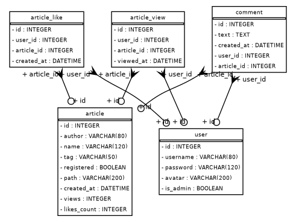
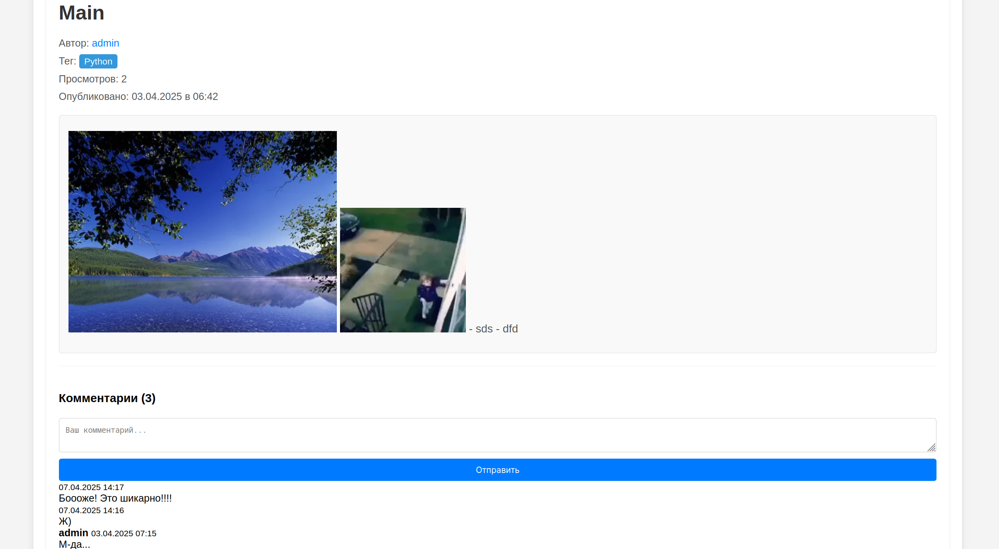
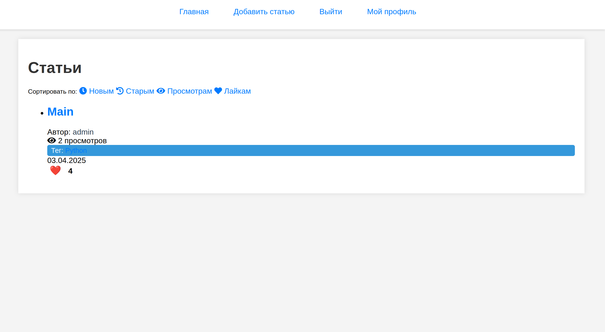

# Техническая записка  
**Проект:** Web_project_yandex  
**Автор:** [ФИО]  
**Дата:** [Текущая дата]  

## 1. Введение  

### 1.1. Назначение проекта  
Веб-приложение для публикации и управления статьями с функциями:  
- Комментирование  
- Лайки  
- Аналитика просмотров  
- Интеграция с Telegram-ботом  

### 1.2. Целевая аудитория  
- **Авторы:** регистрация, публикация контента  
- **Читатели:** просмотр статей, комментарии  
- **Администраторы:** управление пользователями и контентом  

## 2. Техническое описание  

### 2.1. Используемые технологии  
**Backend:**  
- Python 3 (основной язык)  
- Flask (микрофреймворк)  
- SQLAlchemy (ORM)  
- Flask-Login (аутентификация)  
- Markdown → HTML конвертер  

**Frontend:**  
- HTML/CSS  
- Jinja2 (шаблонизация)  

**Дополнительно:**  
- Telegram Bot API (`python-telegram-bot`)  
- SQLite (локальная БД)  

## 3. Архитектура системы  

### 3.1. Компоненты приложения  
- **`main.py`**:  
  - Роутинг (Flask)  
  - Работа с БД (SQLAlchemy)  
  - Аутентификация (Flask-Login)  
  - API для бота  
- **`convert.py`** — конвертер Markdown → HTML  
- **`bot.py`** — Telegram-бот для доступа к статьям  
- **База данных (`base_d/database.db`)** — SQLite:  
  - Пользователи  
  - Статьи  
  - Комментарии  
  - Лайки/просмотры  

## 4. Основные функции  

### 4.1. Управление статьями  
- Создание/редактирование/удаление  
- Конвертация Markdown → HTML  
- Фильтрация по тегам (Python, Flask и др.)  
- Доступ только для зарегистрированных  

### 4.2. Пользовательская система  
- Регистрация/авторизация  
- Загрузка аватаров  
- Права: админ/пользователь  

### 4.3. Аналитика  
- Учёт просмотров (анонимных/авторизованных)  
- Лайки  
- Сортировка по популярности  

### 4.4. Telegram-бот  
- `/articles` — список статей  
- `/article [id]` — детали статьи  
- `/users` — список пользователей  
- `/tags` — список тегов  

## 5. API  
REST API для работы с данными:  

| Endpoint              | Метод | Описание                          |  
|-----------------------|-------|-----------------------------------|  
| `/api/articles`       | GET   | Список статей (сортировка)        |  
| `/api/articles/<id>`  | GET   | Детали статьи                     |  
| `/api/users`          | GET   | Список пользователей              |  
| `/api/tags`           | GET   | Список тегов                      |  

## 6. Заключение  
**Ссылки:**  
- Репозиторий: [https://github.com/acturus1/Web_project_yandex](#)  
- Демо: [https://vikyt.pythonanywhere.com/](#)  

**Приложения:**  
1. Схема БД

2. Скриншоты интерфейса 

